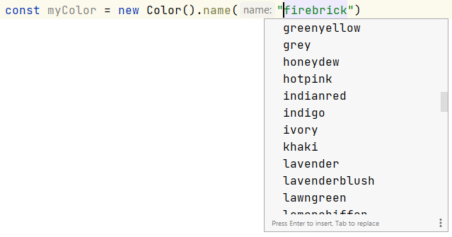

# Color Magic


Color magic is a fully typed JavaScript color manipulation library with zero dependency. You can generate, manipulate and access colors in popular color formats.

## Install

```shell
$ npm i @fly-lab/color-magic
$ pnpm i @fly-lab/color-magic
$ yarn add @fly-lab/color-magic
```

## Usage

```typescript
import { Color } from "@fly-lab/color-magic";

const myColor = new Color();
```

## Color Constructions

```typescript
// RGB construction
myColor.rgb(100, 150, 200); // with r, g and b values
myColor.rgb(100, 150, 200, 0.5); // with r, g, b and alpha values

// HSL construction
myColor.hsl(120, 70, 90); // with h, s and l values
myColor.hsl(120, 70, 90, 0.5); // with h, s, l and alpha values

// HEX construction
myColor.hex("abc"); // hex three letter 
myColor.hex("#abc"); // hex three letter with starting #
myColor.hex("aabbcc"); // hex six letter
myColor.hex("#aabbcc"); // hex six letter with starting #
myColor.hex("#aabbccdd"); // hex six letter with alpha starting #

// CSS color name construction
myColor.name("blanchedalmond");
myColor.name("firebrick");
```

## Color String Construction

Now you can construct colors from any valid color strings. Check [validation](#color-validation) for details.

```typescript
// any valid rgb, hsl or hex string
myColor.string("rgb(255,25,2)");
myColor.string("rgb(50% 30% 10%)");
myColor.string("rgba(255 25 2 / 0.5)");
myColor.string("rgba(50% 30% 10% / 0.5)");
myColor.string("hsl(180 100% 50%)");
myColor.string("hsl(180deg 100% 50%)");
myColor.string("hsl(3.14rad 100% 50%)");
myColor.string("hsl(0.5turn 100% 50%)");
myColor.string("hsla(180 100% 50% / 50%)");
myColor.string("hsla(3.14rad,100%,50%,0.5)");
myColor.string("hsla(0.5turn 100% 50% / 50%)");
myColor.string("abc");
myColor.string("#abc");
myColor.string("aabbcc");
myColor.string("#aabbcc");
myColor.string("#aabbccdd");
```

CSS color name construction is fully typed.



## Color Property Update

```typescript
myColor.rgb(100, 150, 200).red(50); // rgb(100, 150, 200) => rgb(50, 150, 200)
myColor.rgb(100, 150, 200).green(50); // rgb(100, 150, 200) => rgb(100, 50, 200)
myColor.rgb(100, 150, 200).blue(50); // rgb(100, 150, 200) => rgb(100, 150, 50)

myColor.hsl(120, 70, 90).hue(50); // hsl(120, 70%, 90%) => hsl(50, 70%, 90%)
myColor.hsl(120, 70, 90).saturation(50); // hsl(120, 70%, 90%) => hsl(120, 50%, 90%)
myColor.hsl(120, 70, 90).lightness(50); // hsl(120, 70%, 90%) => hsl(120, 70%, 50%)

myColor.rgb(100, 150, 200).alpha(50); // rgba(100, 150, 200, 1) => rgb(100, 150, 200, 0.50)
myColor.rgb(100, 150, 200).transparent(); // rgba(100, 150, 200, 1) => rgb(0, 0, 0, 0)
```

## Color Manipulation

```typescript
// rotate with any positive or negative value
myColor.hsl(100, 70, 50).rotate(50); // hsl(100, 70%, 50%) -> hsl(150, 70%, 75%)
myColor.hsl(100, 70, 50).rotate(-50); // hsl(100, 70%, 50%) -> hsl(50, 70%, 75%)

// 50% increase in lightness
myColor.hsl(120, 70, 50).lighten(50); // hsl(120, 50%, 50%) -> hsl(100, 50%, 75%)
// 50% decrease in lightness
myColor.hsl(120, 70, 50).darken(50); // hsl(120, 50%, 50%) -> hsl(100, 50%, 25%)

// 20% increase in saturation
myColor.hsl(120, 50, 50).saturate(20); // hsl(120, 50%, 50%) -> hsl(100, 60%, 50%)
// 20% decrease in saturation
myColor.hsl(120, 50, 50).desaturate(20); // hsl(120, 50%, 50%) -> hsl(100, 40%, 50%)

// 50% faded
myColor.rgb(50, 100, 200, 0.5).fade(50); // rgba(50, 100, 200, 0.5) -> rgba(50, 100, 200, 0.25)
// 50% brightened
myColor.rgb(50, 100, 200, 0.5).brighten(50); // rgba(50, 100, 200, 0.5) -> rgba(50, 100, 200, 0.75)

// substract each value from 255
myColor.rgb(50, 100, 200, 0.5).negate(50); // rgba(50, 100, 200, 0.5) -> rgba(205, 155, 55, 0.75)

// graying color
// by luminosity algorithom
myColor.rgb(50, 100, 200, 0.5).grayscale("luminosity"); // rgba(50, 100, 200, 0.5) -> rgba(96, 96, 96, 0.5)
// by averaged algorithom
myColor.rgb(50, 100, 200, 0.5).grayscale("averaged"); // rgba(50, 100, 200, 0.5) -> rgba(117, 117, 117, 0.5)

// color blend
const blendColor = new Color().hsl(100, 50, 50, 1);
// 80% myColor + 20% blendColor blend
myColor.rgb(50, 100, 200, 0.5).blend(blendColor, 20) // rgba(50, 100, 200, 0.5) -> rgba(61, 118, 173, 0.5)
```

## Color Query

```typescript
// default to give rgb value
myColor.to(); // rgba(50, 100, 200, 0.5)

// accessing rgb colors
// default value with alpha
myColor.toRgb(); // rgba(50, 100, 200, 0.5)
// without alpha
myColor.toRgb(false); // rgb(50, 100, 200)
// values in percentage with alpha
myColor.toRgb(true, true); // rgba(19.6%, 39.2%, 78.4%, 50%)
// values in percentage without alpha
myColor.toRgb(true, true); // rgb(19.6%, 39.2%, 78.4%)
// return rgb object
myColor.toRgbObj(); // {r: 50, g: 100, b: 200, a: 0.5}

// accessing hsl colors
// default value with alpha
myColor.toHsl(); // hsla(120, 50%, 50%, 1)
// without alpha
myColor.toHsl(false); // hsl(120, 50%, 50%)
// return hsl object
myColor.toHslObj(); // {h: 120, s: 50, l: 50, a: 1}

// accessing hex colors
// default value with alpha
myColor.toHex(); // #40bf40ff
// without alpha
myColor.toHex(false); // #40bf40
// return hex object
myColor.toHexObj(); // {x: '40', y: 'bf', z: '40', a: 'ff'}
```

## Color Information

```typescript
// the WCAG relative luminance of the color. 0 is black, 1 is white
myColor.hsl(120, 50, 50).luminance(); // 0.3872

// the WCAG contrast ratio to another color, from 1 (same color) to 21 (contrast b/w white and black)
const checkColor = new Color().rgb(100, 150, 200, 1);
myColor.hsl(120, 50, 50).contrast(checkColor); // 1.2977

// level of color in "AAA" or "AA" or "AA Large" or ""
// AAA means color constrast ratio is at least 7.0
// AA means color constrast ratio is at least 4.5
// AA Large means color constrast ratio is at least 3.0
const levelColor = new Color().rgb(10, 10, 15, 1);
myColor.hsl(120, 50, 50).level(levelColor); // "AAA"

// is the color dark
myColor.hsl(120, 50, 50).isDark();
// is the color light
myColor.hsl(120, 50, 50).isLight();
```

## Complementary Colors

```typescript
// complementary colors
// gives array of self color and it's complementary color
myColor.hsl(120, 50, 50, 1).complementary();
// can be mapped to do further operations
myColor.hsl(120, 50, 50, 1).complementary().map(c => c.toHsl());
// hsla(120, 50%, 50%, 1)
// hsla(300, 50%, 50%, 1)

// analogous colors
// gives array of self color and it's analogous colors
myColor.hsl(120, 50, 50, 1).analogous();
myColor.hsl(120, 50, 50, 1).analogous().map(c => c.toHsl());
// hsla(120, 50%, 50%, 1)
// hsla(150, 50%, 50%, 1)
// hsla(180, 50%, 50%, 1)

// triadic colors
// gives array of self color and it's triadic analogous colors
myColor.hsl(120, 50, 50, 1).triadic();
myColor.hsl(120, 50, 50, 1).triadic().map(c => c.toHsl());
// hsla(120, 50%, 50%, 1)
// hsla(240, 50%, 50%, 1)
// hsla(360, 50%, 50%, 1)

// split complementary colors
// gives array of self color and it's split complementary colors
myColor.hsl(120, 50, 50, 1).splitComplementary();
myColor.hsl(120, 50, 50, 1).splitComplementary().map(c => c.toHsl());
// hsla(120, 50%, 50%, 1)
// hsla(270, 50%, 50%, 1)
// hsla(330, 50%, 50%, 1)

// split double complementary colors
// gives array of self color, shifted hue color and complementary colors of both
myColor.hsl(120, 50, 50, 1).doubleComplementary();
myColor.hsl(120, 50, 50, 1).doubleComplementary(-30).map(c => c.toHsl());
// hsla(120, 50%, 50%, 1)
// hsla(210, 50%, 50%, 1)
// hsla(90, 50%, 50%, 1)
// hsla(180, 50%, 50%, 1)

// swatch colors
// gives array of self color with shifted colors
myColor.hsl(120, 50, 50, 1).swatch(5);
myColor.hsl(120, 50, 50, 1).swatch(5).map(c => c.toHsl());
// hsla(90, 57.5%, 53.8%, 1)
// hsla(110, 52.5%, 51.2%, 1)
// hsla(120, 50%, 50%, 1)
// hsla(140, 45%, 47.5%, 1)
// hsla(160, 40%, 45%, 1)

// random swatch colors
// gives array of self color with randomly shifted colors
myColor.hsl(120, 50, 50, 1).randomSwatch(5);
myColor.hsl(120, 50, 50, 1).randomSwatch(5).map(c => c.toHsl());
// hsla(360, 50%, 57.5%, 1)
// hsla(210, 72.5%, 67.5%, 1)
// hsla(120, 50%, 50%, 1)
// hsla(240, 45%, 45%, 1)
// hsla(160, 40%, 0%, 1)
```

## Color Validation

You can extensively validate rgb, hsl and hex color strings.

```typescript
myColor.validate("fc32455"); // [true, {method: "hex", alpha: true}]
myColor.validate("#fc324"); // [true, {method: "hex", alpha: false}]
myColor.validate("rgba(255 25 2 / 0.5)"); // [true, {method: "rgb", alpha: true}]
myColor.validate("rgb(50%,30%,10%)"); // [true, {method: "rgb", alpha: false}]
myColor.validate("hsl(0.5turn 100% 50%)"); // [true, {method: "hsl", alpha: false}]
myColor.validate("hsl(0.5% 100% 50%)"); // [false, {method: undefined}]
```

### Valid Color Examples

RGB:
- rgb(255,25,2)
- rgb(255 25 2)
- rgb(50%,30%,10%)
- rgb(50% 30% 10%)
- rgba(255,25,2,0.5)
- rgba(255 25 2 / 0.5)
- rgba(50%,30%,10%,0.5)
- rgba(50%,30%,10%,50%)
- rgba(50% 30% 10% / 0.5)
- rgba(50% 30% 10% / 50%)

HSL:
- hsl(180 100% 50%)
- hsl(180deg,100%,50%)
- hsl(180deg 100% 50%)
- hsl(3.14rad,100%,50%)
- hsl(3.14rad 100% 50%)
- hsl(0.5turn,100%,50%)
- hsl(0.5turn 100% 50%)
- hsla(180,100%,50%,50%)
- hsla(180 100% 50% / 50%)
- hsla(180deg,100%,50%,0.5)
- hsla(3.14rad,100%,50%,0.5)
- hsla(0.5turn 100% 50% / 50%)

HEX:
- ad5
- #ad5
- adc5f2
- #adc5f2
- 7ce945d8
- #7ce945d8

## Color Chaining

You can chain methods as per your requirements.

```typescript
myColor.hsl(120, 50, 50, 1).lighten(10).hue(20).rotate(150).red(100);
myColor.hsl(120, 50, 50, 1).rgb(10, 50, 40).green(30).analogous();
myColor.rgb(10, 50, 40).green(30).desaturate(25).toHex();
myColor.rgb(10, 50, 40).saturate(25).grayscale();
```